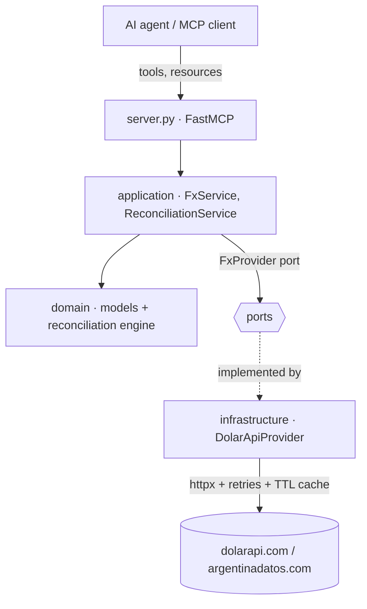

# latamfx-mcp

> An MCP server that exposes **public LatAm FX data** and an **auditable reconciliation engine** to AI agents (Claude Desktop, Claude Code, or any MCP client).

[](https://github.com/floreskemec/latamfx-mcp/actions/workflows/ci.yml)
[](https://www.python.org/)
[](https://modelcontextprotocol.io/)
[](https://docs.astral.sh/ruff/)
[](https://mypy-lang.org/)
[](./LICENSE)

`latamfx-mcp` lets an LLM agent answer questions like *"what's the blue dollar
today?"*, *"convert 1,500 USD to ARS at the MEP rate"*, or *"reconcile these two
ledgers and tell me what didn't match"* — entirely from free, key-less public
APIs. No credentials, no client data.

It doubles as a **reference implementation** of a production-shaped MCP server:
hexagonal architecture, typed contracts, retries with backoff, a TTL cache,
contract tests against mocked HTTP, CI, Docker and a Cloud Run deployment module.

---

## Tools

| Tool | What it does |
| --- | --- |
| `list_fx_sources` | List supported sources (oficial, blue, MEP, CCL, mayorista, cripto, tarjeta). |
| `get_fx_quote` | Latest buy/sell quote for a source. |
| `get_fx_timeseries` | Historical buy/sell series (most recent *N* points). |
| `get_fx_stats` | min / max / mean / volatility of the mid price (computed with Polars). |
| `convert` | Convert an amount between currencies using a source's quote (USD↔ARS). |
| `reconcile` | Match two ledgers with a multi-rule engine; returns matches, misses and a match rate. |

Plus a resource: `fx://sources` (the source catalog as text).

### The reconciliation engine

`reconcile` is a sanitized, generic version of intercompany / bank
reconciliation engines used in real fintech work. Rules run in priority order
and each right-side entry is consumed at most once, so the output is a valid
one-to-one assignment where **every match is traceable to the rule that produced
it**:

1. **`exact_reference`** — same non-empty external reference (score 1.0).
2. **`amount_date`** — equal amount within a day-tolerance window (score decays with the gap).
3. **`fuzzy_description`** — equal amount + similar free-text description above a threshold.

---

## Architecture

Hexagonal (ports & adapters): the domain and application layers know nothing
about HTTP or MCP, so the engine is pure and the data source is swappable.



```
src/latamfx_mcp/
├── domain/           # pure models + reconciliation engine (no I/O)
├── ports/            # FxProvider Protocol (dependency inversion)
├── application/      # use cases: FX + reconciliation
├── infrastructure/   # httpx adapter, retry policy, TTL cache
├── config.py         # env-driven settings
└── server.py         # FastMCP wiring (tools + resource)
```

See [`docs/architecture.md`](./docs/architecture.md) and the
[ADRs](./docs/adr/) for the design decisions.

---

## Quickstart

Requires [uv](https://docs.astral.sh/uv/).

```bash
git clone https://github.com/floreskemec/latamfx-mcp.git
cd latamfx-mcp
uv sync
uv run latamfx-mcp     # starts the MCP server over stdio
```

### Use it from Claude Code

```bash
claude mcp add latamfx -- uv --directory /absolute/path/to/latamfx-mcp run latamfx-mcp
```

### Use it from Claude Desktop

Add to `claude_desktop_config.json`:

```json
{
  "mcpServers": {
    "latamfx": {
      "command": "uv",
      "args": ["--directory", "/absolute/path/to/latamfx-mcp", "run", "latamfx-mcp"]
    }
  }
}
```

Then ask Claude: *"Using latamfx, convert 1500 USD to ARS at the blue rate and
show me the last 7 days of the blue dollar."*

---

## Development

```bash
uv sync
uv run pytest            # tests + coverage
uv run ruff check .      # lint
uv run ruff format .     # format
uv run mypy              # static types
```

Configuration is read from environment variables (all optional):

| Variable | Default | Purpose |
| --- | --- | --- |
| `LATAMFX_HTTP_TIMEOUT` | `10.0` | HTTP timeout (seconds). |
| `LATAMFX_HTTP_RETRIES` | `3` | Max attempts on transient failures. |
| `LATAMFX_CACHE_TTL` | `60.0` | Quote/series cache TTL (seconds). |

---

## Deployment

A multi-stage [`Dockerfile`](./Dockerfile) builds a slim image, and
[`deploy/terraform`](./deploy/terraform) contains a minimal OpenTofu/Terraform
module to run it on **Google Cloud Run**. See the
[deploy README](./deploy/terraform/README.md).

---

## Data sources

- [dolarapi.com](https://dolarapi.com) — latest quotes.
- [ArgentinaDatos](https://argentinadatos.com) — historical series.

Both are free, community-maintained public APIs. This project is not affiliated
with them; please review their terms before heavy use.

## License

[MIT](./LICENSE) © Gonzalo Flores Kemec
