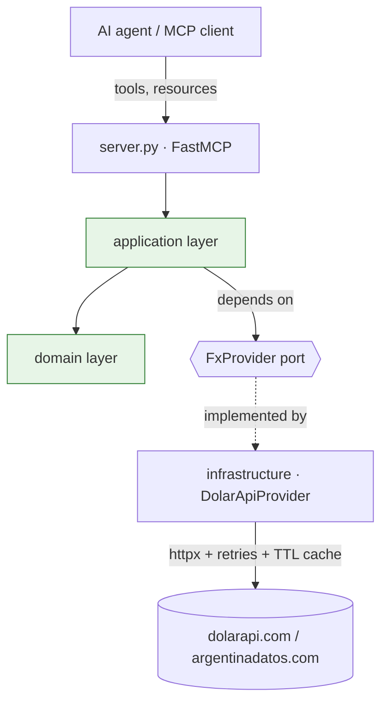

# Architecture

`latamfx-mcp` follows a **hexagonal (ports & adapters)** layout. The goal is that
the interesting logic — FX conversion policy and the reconciliation engine — lives
in pure code with no knowledge of HTTP, MCP or any vendor, so it is trivial to
test and reason about.

## Layers

| Layer | Package | Responsibility | Knows about |
| --- | --- | --- | --- |
| Domain | `domain/` | Value objects, the reconciliation engine and rules. Pure, deterministic. | Nothing external |
| Ports | `ports/` | `FxProvider` Protocol — the contract the app depends on. | Domain only |
| Application | `application/` | Use cases: quotes, time series, conversion, reconciliation. | Domain + ports |
| Infrastructure | `infrastructure/` | HTTP adapter, retry policy, TTL cache. | Ports + the outside world |
| Transport | `server.py` | FastMCP wiring: registers tools and resources. | Application |

## Why this matters here

- **Testability.** The domain has no I/O, so the reconciliation rules are tested
  with plain in-memory objects. The application is tested against a `FakeFxProvider`.
  The adapter is tested against mocked HTTP (`respx`). No test hits the network.
- **Swappable data sources.** Adding a BCRA or a global-FX provider means writing
  a new adapter that satisfies `FxProvider`; nothing upstream changes.
- **Decimal-safe money.** All monetary values are `Decimal`, parsed from upstream
  via `str()` to avoid binary-float drift — a non-negotiable in financial code.

## Request flow (example: `convert`)

1. The agent calls the `convert` tool on the server.
2. `server.py` validates inputs and delegates to `FxService.convert`.
3. `FxService` asks the injected `FxProvider` for the latest quote.
4. `DolarApiProvider` returns a cached quote or fetches it with retries.
5. `FxService` applies the buy/sell policy and returns a `ConversionResult`.
6. The server serializes it to JSON for the agent.
